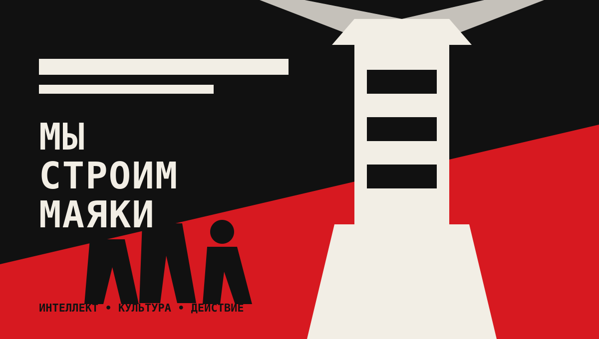
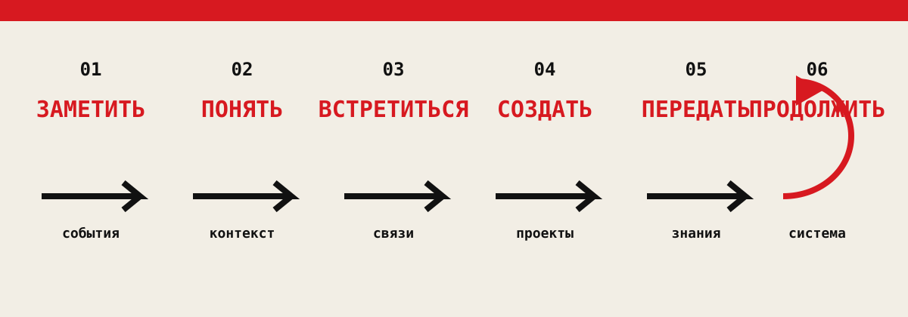
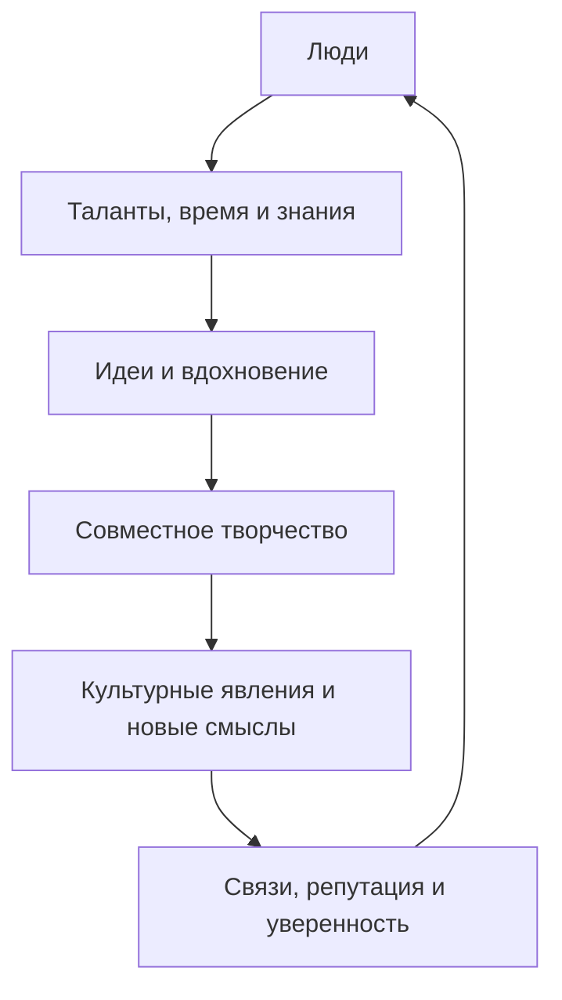
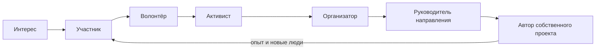
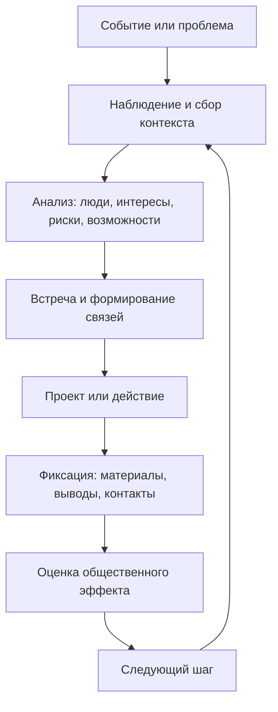

# Идеология КОМП

> **Рабочая версия 1.0**
>
> КОМП — Казанское объединение молодых поэтов. Это сообщество людей, которые хотят быть настоящими, думать, чувствовать и создавать.

## Навигация

**Документы:** [План развития](README.md) · [Идеология КОМП](IDEOLOGY.md#идеология-комп) · [Субкультура и богема](SUBCULTURES.md)

**Разделы:** [Миссия](IDEOLOGY.md#наша-миссия) · [Проблемы](IDEOLOGY.md#какие-проблемы-решаем) · [Субкультурная рамка](IDEOLOGY.md#субкультурная-рамка) · [Ценности](IDEOLOGY.md#семь-ценностей) · [Нематериальный капитал](IDEOLOGY.md#главный-капитал) · [Активист](IDEOLOGY.md#каким-должен-быть-активист) · [Результаты](IDEOLOGY.md#что-считаем-общественно-значимым-результатом) · [Рабочая модель](IDEOLOGY.md#рабочая-модель)

## Коротко

КОМП существует, чтобы человек мог не только потреблять культуру, но и создавать её сам — вместе с другими, без ожидания внешнего одобрения, большого бюджета или готовой системы.

Мы строим пространство, где идеи и чувства имеют значение, разные люди находят единомышленников, а простые усилия превращаются в культурные явления, новые смыслы и связи.

**Наш переход:** от зрителя к автору, от одиночного импульса к объединению, от нехватки денег к силе нематериального капитала.

## Зачем мы существуем

## Почему мы нужны

Нам не нравится, что в современном обществе творчество считают чем-то «бесполезным», а искренность и честность — слабостью.

Мы с этим не согласны.

Человека часто оценивают по статусу, формальным достижениям и полезности функции. КОМП исходит из другого: ценен сам человек и его желание развиваться и творить.

## Наша миссия

Мы хотим, чтобы люди:

- не только потребляли культуру, но и создавали её сами;
- чувствовали, что их идеи и чувства имеют значение;
- могли объединяться и творить вместе;
- видели, что даже без большого капитала можно создавать новое культурное пространство;
- получали поддержку и сами помогали другим развиваться.

## Какие проблемы решаем

### 1. Пассивное потребление вместо участия

Молодой человек часто остаётся зрителем чужих мероприятий и проектов. Мы создаём понятные роли и следующий шаг, чтобы участие могло перейти в действие.

### 2. Зависимость от одного организатора

Если знания, коммуникации и решения сосредоточены у одного человека, сообщество не растёт устойчиво. Мы переводим опыт в шаблоны, процессы, роли и открытые материалы.

### 3. Разрозненность людей и инициатив

Интересные люди, события и организации существуют рядом, но не всегда находят друг друга. Мы развиваем мониторинг, нетворкинг и культуру продолжения контакта.

### 4. Недостаток интеллектуальной и культурной среды

Одного развлечения недостаточно для развития. Нам нужны разговор, исследование, публичное мышление, культурная грамотность и возможность делать собственные проекты.

### 5. Потеря опыта после события

Встреча заканчивается, а выводы, связи и материалы исчезают. Мы фиксируем результаты, превращаем их в знания и используем как основу для следующего действия.

## Субкультурная рамка

Материал о субкультурах и богеме помогает уточнить, как КОМП может стать не только серией мероприятий, но и живой культурной средой. Подробная компоновка тезисов, рисков и возможных форматов собрана в отдельном документе [«Субкультура, богема и культурное сообщество»](SUBCULTURES.md).

Ключевые выводы для идеологии КОМП:

- субкультура — это общий язык, атмосфера и практика участия, а не единый внешний стиль;
- контркультурность определяется не маркерами протеста, а способностью осмыслять реальные проблемы и создавать новые формы действия;
- художественная чувствительность и поэтичность важны, но должны переводиться в тексты, события, исследования и проекты;
- каждое мероприятие должно помогать перейти от зрительства к следующему шагу и оставлять после себя связи, знания или материал;
- открытость требует правил ненасильственного общения, защиты от снобизма, эскапизма, имитации протеста и зависимости от одного лидера;
- масштаб сообщества имеет смысл только вместе с ростом самостоятельности участников и плотности связей.

Эта рамка связывает нашу критику пассивного потребления с практической задачей: создавать пространство, где человек не только выражает себя, но и учится действовать вместе с другими.

## Семь ценностей

### В сообществе

1. **Искренность.** Можно быть собой, говорить честно и не притворяться.
2. **Открытость.** Мы оставляем место для разных людей, взглядов, форм и путей участия.
3. **Действие.** Идея становится живой, когда её пробуют реализовать.
4. **Поддержка.** Мы замечаем усилия друг друга и помогаем расти.

### В творчестве и деятельности

5. **Авангардность.** Выходим за социальные барьеры и стереотипы, поощряем эксперименты.
6. **Развитие.** Постоянно растём, обмениваемся знаниями и исследуем новые формы искусства и коммуникации.
7. **Актуальность.** Отражаем дух времени и говорим с современностью через творчество.

Эти ценности не требуют одинаковости. Поэтому мы такие разные: общий язык создаётся не единым стилем, а готовностью творить вместе.

## Главный капитал

У КОМП может не быть финансового капитала. Но есть способности создавать то, что нельзя купить: идеи, красоту, знания, репутацию, известность, связи, вдохновение и искусство.

Это **нематериальный капитал**. Его особенность в том, что при обмене он не уменьшается. Когда мы делимся знаниями, временем, талантами и вниманием, сильнее становится всё сообщество.

Мы «скидываемся» не деньгами, а нематериальными ресурсами. Так возникают культурные явления, новые смыслы и тренды.

## Каким должен быть активист

Активист — не должность и не идеальный человек. Это участник, который берёт ответственность за следующий шаг и помогает другим получить такую же возможность.

Он или она:

- остаётся собой и уважает искренность других;
- приходит не только за готовым продуктом, но и с готовностью вложиться;
- превращает интерес в конкретное действие;
- умеет сотрудничать, слушать и поддерживать;
- делится знаниями, временем, связями и талантом;
- не ждёт идеальных условий для первого шага;
- понимает, что его вклад влияет на общий результат;
- помогает следующему человеку почувствовать собственную значимость.

**Минимальная формула участника:** чувствовать → думать → объединяться → создавать → поддерживать.

## Наша цель

Создать влиятельное и крупнейшее в России творческое сообщество, объединяющее поэтов, писателей и мыслителей для свободного самовыражения, взаимного вдохновения, поддержки и совместного развития.

## Как устроено движение участника

Переход между уровнями определяется не статусом, а практикой: что человек сделал, чему научился, какую ответственность способен принять и какой результат оставил после себя.

## Что считаем общественно значимым результатом

Общественно значимым является не только число участников. Результат важен, если он увеличивает способность людей понимать происходящее, сотрудничать и действовать самостоятельно.

## Что уже доказано практикой

На момент презентации КОМП:

- провёл много [мероприятий](https://github.com/bydenisby/KOMP_posts_mds/blob/main/README.md) разных форматов;
- собрал команду более чем из 70 человек.

Для нас важен не только количественный рост. Если деятельность и созданная атмосфера помогли хотя бы одному человеку поверить в себя и свои силы, это уже победа.

- человек почувствовал, что его идеи и чувства имеют значение;
- новый участник получил безопасную возможность быть собой и попробовать творить;
- зритель стал автором, организатором или соавтором;
- появились новые стихи, тексты, события, клубы, медиа или культурные проекты;
- люди объединились вокруг идеи и продолжили действовать вместе;
- нематериальный капитал сообщества вырос: знания, связи, вдохновение, репутация;
- созданная атмосфера помогла кому-то поверить в себя;
- результат остался доступным другим и стал основой для следующего шага.

### Вопросы проверки

Перед тем как назвать работу успешной, спросите:

1. Что стало понятнее?
2. Кто получил возможность действовать самостоятельно?
3. Какие связи и знания остались после события?
4. Что продолжится без первоначального организатора?
5. Кому это принесло пользу и кому мы не дали доступа?

## Рабочая модель

Эта модель соединяет три направления работы сообщества:

- **интеллектуальное:** исследовать, сопоставлять, формулировать;
- **культурное:** создавать пространство встречи, разговора и выражения;
- **общественное:** переводить понимание в совместное и ответственное действие.

## Граница идеологии

Мы не стремимся просто собрать как можно большую аудиторию. Масштаб имеет смысл только тогда, когда вместе с ним растут самостоятельность участников, качество связей, доступность знаний и способность сообщества создавать новые проекты.

Этот документ — не набор лозунгов раз и навсегда. Это рабочая база, которую нужно проверять практикой, обсуждать с участниками и обновлять по мере развития сообщества.

## Источник

- [Презентация «КОМП — Казанское объединение молодых поэтов»](<ideology_materials/%D0%BA%D0%BE%D0%BC%D0%BF%20ideology.pdf>) — основной источник версии 1.0.
- [Субкультура, богема и культурное сообщество](SUBCULTURES.md) — аналитическая компоновка заметок о субкультурах, богеме, контркультурном импульсе и форматах работы КОМП.
- [Исходные заметки «Субкультуры и богема»](<ideology_materials/%D0%A1%D1%83%D0%B1%D0%BA%D1%83%D0%BB%D1%8C%D1%82%D1%83%D1%80%D1%8B%20%D0%B8%20%D0%B1%D0%BE%D0%B3%D0%B5%D0%BC%D0%B0.pdf>) — материал для аналитической компоновки.
- [План развития сообщества](README.md) — организационный контекст и планы развития.

[← Вернуться к навигации](IDEOLOGY.md#навигация) · [Перейти к плану развития →](README.md)
