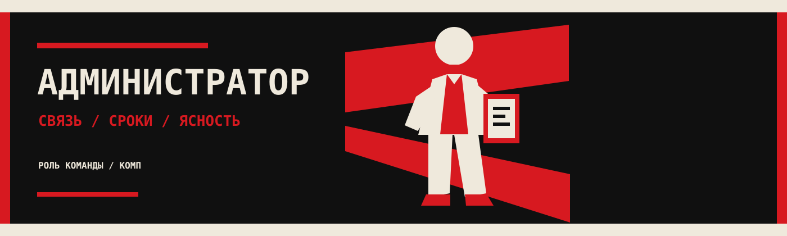
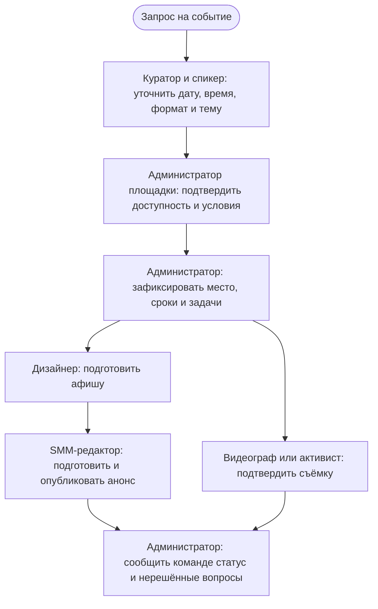
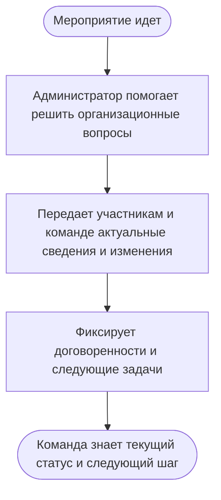
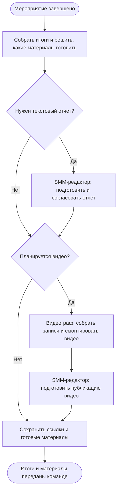

# Администратор

> Этот документ носит рекомендательный характер: он помогает сориентироваться в роли и договориться о рабочем процессе, но не является обязательным регламентом.

## Назначение

Администратор поддерживает рабочий порядок, благодаря которому другие роли выполняют свои задачи согласованно и  вовремя.

## Онбординг

Перед началом работы администратору полезно:

- выбрать и познакомиться с куратором направления, с которыми предстоит взаимодействовать;
- уточнить, где ведутся записи событий, задачи и в каких чатах ведётся рабочая переписка;
- выяснить, кто подтверждает событие, кто согласует площадку и кто принимает материалы к публикации;
- договориться, как фиксировать задачи, сроки, ответственных и изменения;
- начать с одного события и пройти вместе с куратором его подготовку, проведение и завершение.

На старте достаточно координировать процесс и отмечать пробелы. Не нужно заранее знать все ответы: важно вовремя выяснять их у ответственных и возвращать команде в виде понятных договорённостей.

## Задачи

### До события (Мероприятия)

- Уточняет у куратора направления и спикера (модератора или ведущего) дату, время, формат, тему и ожидаемую продолжительность события.
- Проверяет с администратором площадки доступность места, условия проведения и время доступа; фиксирует выбранную площадку после подтверждения ответственными.
- Создаёт или обновляет запись в рабочих чатах (или локально у себя): ответственный, срок, статус и ссылка на нужные материалы.
- Передаёт дизайнеру афиши согласованные сведения и срок подготовки макета.
- Передаёт SMM-редактору данные для анонса и согласует сроки публикации. Проверяет, что текст и афиша готовы и публикация запланирована; редактор отвечает за подготовку и публикацию материала.
- Напоминает видеографу или назначенному активисту о съёмке, формате материалов и договорённостях по передаче файлов.
- Сообщает команде об изменениях и проверяет готовность ключевых задач перед событием.

### Во время события

- Помогает команде с организационными вопросами и изменениями расписания.
- При необходимости передаёт участникам актуальную информацию о месте, времени и порядке проведения.
- Уточняет, кто фиксирует организационные договорённости и куда передать возникшие задачи.

### После события

- Может собирать (собрать) у ответственных короткие итоги и замечания.
- Если команда решила подготовить публикацию по итогам, напоминает SMM-редактору о тексте и согласовании материалов.
- Просит видеографа или назначенного участника собрать исходные записи, отобрать материалы и согласовать срок монтажа.
- После подготовки и согласования видео помогает запланировать публикацию на подходящих площадках (например, YouTube или TikTok), подготовить описание и теги. Проверяет, что публикация вышла или автопостинг настроен, если он доступен.

Схемы показывают примерные потоки взаимодействия, а не обязательную последовательность для каждого события. Не каждый этап или материал нужен в каждом случае.

## Результат

У команды есть понятные сроки и согласованны шаги до, во время и после мероприятия. Риск спонтанности и потерянных договорённостей снижается.

## Границы

- Администратор координирует выполнение договорённостей, но не становится владельцем всех решений.
- Спикер отвечает за содержание и проведение встречи; редактор — за текст, визуальные материалы и публикации; администратор площадки — за доступность и условия места.
- Администратор не публикует материалы от имени редактора без отдельной договорённости и нужного доступа.
- Если срок или решение не подтверждены, администратор обозначает это команде и помогает найти ответственного, а не подменяет его.

## Рост

Администратор может самостоятельно описать и улучшить процесс для спикеров, видеографов, редакторов и администраторов площадок так, чтобы они могли повторить его без постоянных подсказок. Следующий шаг — передать этот процесс другому участнику и проверить, что документации достаточно.

[← К каталогу ролей](README.md) · [К плану развития](../README.md) · [К идеологии КОМП](../IDEOLOGY/IDEOLOGY.md)
