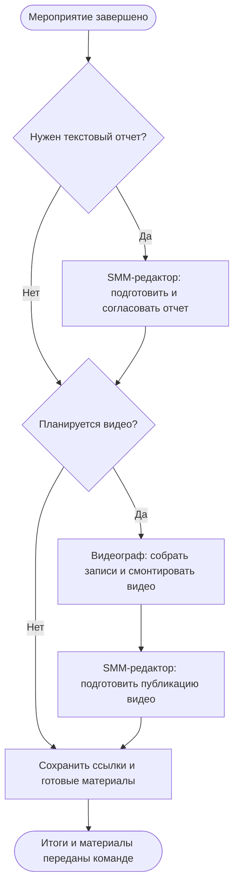

```mermaid
flowchart TD
    A([Мероприятие завершено]) --> C{Нужен текстовый отчет?}
    C -->|Да| D[SMM-редактор: подготовить и согласовать отчет]
    C -->|Нет| E{Планируется видео?}
    D --> E
    E -->|Да| F[Видеограф: собрать записи и смонтировать видео]
    F --> G[SMM-редактор: подготовить публикацию видео]
    E -->|Нет| H[Сохранить ссылки и готовые материалы]
    G --> H
    H --> I([Итоги и материалы переданы команде])
```
[[administrator]]