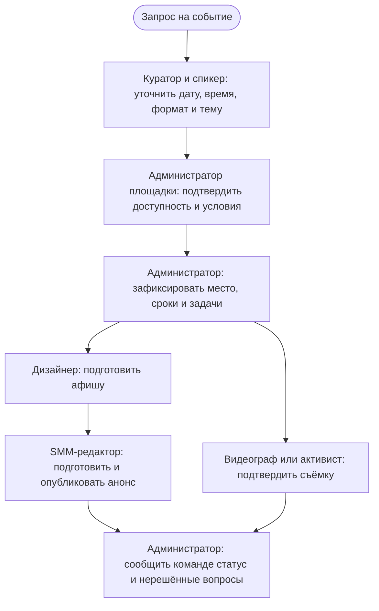

```mermaid
flowchart TD
    A([Запрос на событие]) --> B[Куратор и спикер: уточнить дату, время, формат и тему]
    B --> C[Администратор площадки: подтвердить доступность и условия]
    C --> D[Администратор: зафиксировать место, сроки и задачи]
    D --> E[Дизайнер: подготовить афишу]
    E --> F[SMM-редактор: подготовить и опубликовать анонс]
    D --> G[Видеограф или активист: подтвердить съёмку]
    F --> H[Администратор: сообщить команде статус и нерешённые вопросы]
    G --> H
```
[[administrator]]