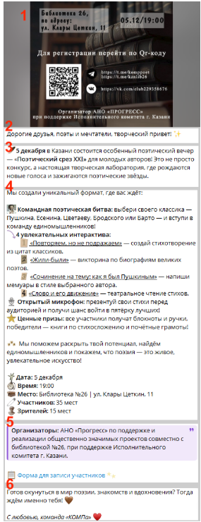
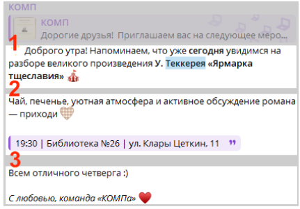
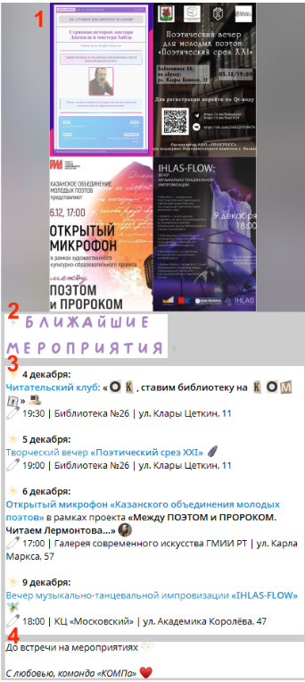
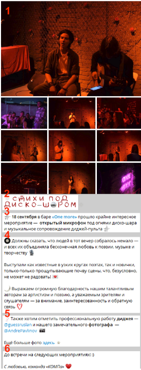

# Нерегулярные разметки оформления постов

> Источник: [«Гайд для редакторов v.2.1.0.pdf»](./smm_materials/Гайд%20для%20редакторов%20v.2.1.0.pdf)

## Навигация

- [Анонсы мероприятий](#анонсы-мероприятий)
- [Напоминания о предстоящих мероприятиях](#напоминания-о-предстоящих-мероприятиях)
- [Рассказы о прошедших мероприятиях](#рассказы-о-прошедших-мероприятиях)
- [Объявления](#объявления)

---

## Анонсы мероприятий

Пост с анонсом должен быть понятным, информативным и быстро считываемым. У всех мероприятий одна и та же логика: афиша + приветствие + краткий контекст + ключевые детали.

### Базовый принцип

1. Просим афишу у дизайнера.
2. Пишем приветствие.
3. Добавляем контекст события, если он нужен.
4. Указываем:
   - список активностей;
   - дату;
   - время;
   - место;
   - количество мест, если это важно.
5. Добавляем детали: организаторы, форма записи, ссылки.
6. Завершаем подписью.

### Рекомендуемая структура

- Приветствие;
- контекст;
- основная часть: программа, дата, время, место, запись;
- детали;
- подпись.

### Пример поста

[Ссылка на пример поста в Telegram](https://t.me/komppoet/1526)

> 1. Просим афишу у дизайнера.
> 2. Пишем приветствие.
> 3. Добавляем контекст мероприятия, если это необходимо.
> 4. Пишем основную часть. Она содержит:
> 5. Добавляем детали. В данном случае это:
> 6. Добавляем подпись.

---

## Напоминания о предстоящих мероприятиях

Напоминания нужны, чтобы читатель не пропустил событие, даже если он видел анонс раньше.

### Базовый принцип

#### Вариант 1: одно мероприятие

### Пример поста

[Ссылка на пример поста в Telegram](https://t.me/komppoet/1526)

> 1. Пишем приветствие – указываем, о каком мероприятии идёт речь.
> 2. Пишем основную часть – подробности о проведении мероприятия, дату, место и т.д.
> 3. Добавляем подпись.

#### Вариант 2: несколько мероприятий

### Пример поста

[Ссылка на пример поста в Telegram](https://t.me/komppoet/1526)

> 1. Создаём коллаж из всех афиш в любом подходящем редакторе.
> 2. Вместо приветствия можно использовать эмодзи в виде букв как на скриншоте, чтобы сделать пост более лаконичным.
> 3. Пишем основную часть – список мероприятий, где каждый элемент списка это:
> 4. Добавляем подпись.

---

## Рассказы о прошедших мероприятиях

Задача такого поста — передать эмоции и дать читателю почувствовать атмосферу уже состоявшегося события.

### Базовый принцип

1. Создаём коллаж из лучших фотографий.
2. Используем короткое приветствие, можно с эмодзи-буквами.
3. Добавляем контекст: что это за мероприятие и когда оно проходило.
4. Пишем основную часть с подробностями проведения.
5. Указываем участников: поэты, музыканты, диджеи, фотографы, ведущие, канал площадки.
6. Добавляем ссылку на архив с фото, если она есть.
7. Завершаем подписью.

### Рекомендуемая структура

- приветствие или эмодзи;
- контекст;
- подробности мероприятия;
- детали с участниками;
- подпись.

### Пример поста

[Ссылка на пример поста в Telegram](https://t.me/komppoet/1526)

> 1. Создаём коллаж из самых удачных фотографий от наших фотографов. Ссылку на архив с фотографиями просим у Андрея Павлинова (tg: @AndrePavlinov).
> 2. Вместо приветствия можно использовать эмодзи в виде букв как на скриншоте, чтобы сделать пост более лаконичным.
> 3. Добавляем контекст мероприятия – что это за мероприятие и когда оно проходило.
> 4. Пишем основную часть – подробности о проведении мероприятия, дату, место и т.д.
> 5. Пишем детали – указываем всех лиц, участвующих в проведении мероприятия:
>
> Вместо ссылок на страницы участников оставляем ссылки на их каналы. Ссылки добавляем только если сами участники дают на это разрешение.
>
> Также оставляем ссылку на архив с фото при его наличии.
>
> 6. Добавляем подпись.

---

## Объявления

Это свободный формат, который не привязан к строгим рубрикам. Главное — сохранить три обязательных блока.

### Обязательная структура

1. Приветствие;
2. Основная часть;
3. Подпись.

### Примеры случаев

- розыгрыш призов;
- просьба «забустить» канал;
- объявление о новом функционале;
- важное сообщение, не вписывающееся в тематическую рубрику.

---

## Короткая памятка

Нерегулярные рубрики чаще всего строятся по схеме:

- событие или объявление;
- краткая подача через контекст;
- важные даты, время и место;
- один финальный блок с подписью.

Главное — не терять дружелюбный и вовлекающий тон канала.
