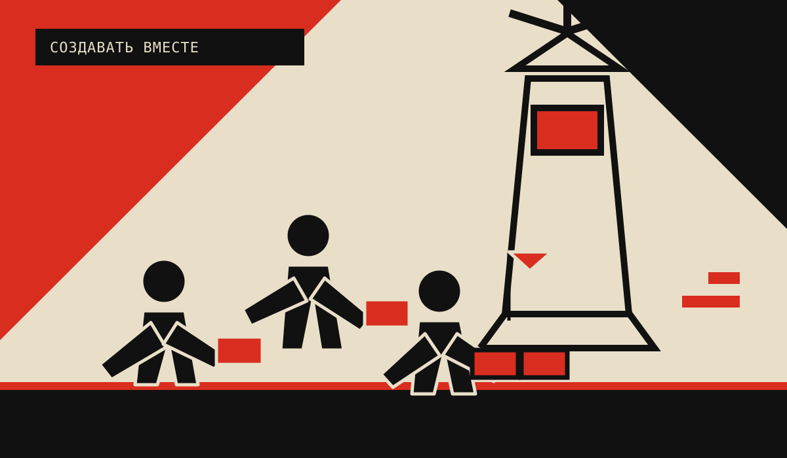
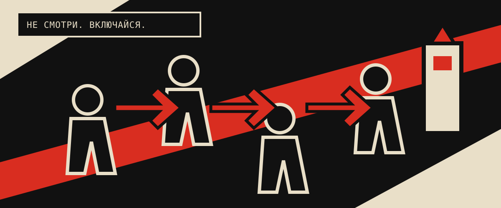

# Субкультура, богема и культурное сообщество

> **Аналитическое приложение к идеологии КОМП**
>
> Документ составлен по материалам заметок [«Субкультуры и богема»](ideology_materials/%D0%A1%D1%83%D0%B1%D0%BA%D1%83%D0%BB%D1%8C%D1%82%D1%83%D1%80%D1%8B%20%D0%B8%20%D0%B1%D0%BE%D0%B3%D0%B5%D0%BC%D0%B0.pdf), автор — [Ильдар Фаляхов (@ildarrfa)](https://t.me/ildarrfa). Это рабочая компоновка авторских тезисов и предложений, а не академическое исследование и не утверждение, что все приведённые интерпретации доказаны.

## Коротко

**ЧУВСТВОВАТЬ → ДУМАТЬ → СОЕДИНЯТЬСЯ → СОЗДАВАТЬ**

Не новый стиль ради стиля. Субкультура КОМП — это молодые люди, общий язык, живое событие и следующий шаг после него.

## Зачем эта рамка

Для КОМП важно понимать сообщество не только как аудиторию мероприятий, но и как формирующуюся культурную среду. Рамка помогает ответить на четыре вопроса:

1. Почему человек остаётся зрителем?
2. Как интерес становится действием?
3. Как соединить поэтичность и устойчивость?
4. Как не превратить протест в новый спектакль?

## 1. Основные понятия

### Культура и субкультура

**Субкультура = язык + эстетика + память + практика участия.**

Для КОМП это не закрытая тусовка, а стартовая площадка для проектов.

### Контркультурный импульс

Ответ на кризис культуры, лицемерие и отчуждение.

**Критерий:** не внешний стиль, а новые формы мышления, солидарности и действия.

### Богема

Чувствительность к форме, атмосфере и несоответствию между живым опытом и официальной культурой.

**Задача КОМП:** переводить импульс в текст, событие, исследование или проект.

## 2. Проблема: общество спектакля

Когда образ жизни, протест и личность становятся витриной:

- опыт подменяется демонстрацией;
- участие сводится к просмотру, лайку и декларации;
- протест становится безопасным стилем;
- мягкое давление работает через тщеславие, сравнение и тревогу.

**Различать:** событие и витрину · поддержку и имитацию · самовыражение и личный бренд.

## 3. Что должна делать субкультурная среда

Среда должна не просто собирать людей, а передавать импульс от одного участника к другому — до общего проекта.

### От зрителя к автору

После разговора — текст, кинопоказ, интервью, исследование, роль или проектная группа.

### Работа и отдых

Знание может быть трудным, красивым и совместным. Форматы: встречи, киноклубы, чтения, маршруты, создание материалов.

### Связь

Ответ атомизации: взаимопомощь, ненасильственное общение, распределённая ответственность и продолжение контакта.

### Форма

Атмосфера помогает почувствовать проблему, назвать её и перейти к действию.

## 4. Риски и ограничения

**Риски:**

- эклектика без общего дела;
- эскапизм вместо взаимодействия с реальностью;
- имитация протеста;
- зависимость от одного лидера;
- сектантство и снобизм;
- выгорание без передачи опыта.

**Ответ КОМП:** выразительная культура + открытость + роли + границы + сменяемое лидерство.

## 5. Принципы для КОМП

1. **Общий язык без единообразия.** Практика, ценности, уважение.
2. **Подлинность проверяется действием.** Текст, проект, связь, навык.
3. **У каждого события есть продолжение.** Канал, встреча, задача, роль.
4. **Атмосфера ведёт к самостоятельности.** Переживание → действие.
5. **Различия не отменяют договорённости.** Общение, безопасность, ответственность.
6. **Критика не заменяет создание.** Анализ → собственная форма культуры.
7. **Сообщество не замыкается на лидере.** Знания и инициатива распределяются.
8. **Масштаб не важнее связей.** Рост = сотрудничество + результат.

## 6. Возможные форматы

### Киноклуб

Фильм → разговор о культуре, городе, труде, образе и протесте → проект.

### Поэтическая и художественная лаборатория

Чтение → форма → эксперимент → публикация → взаимная редактура.

### Интеллектуальный клуб

Регулярность + доверие + общий интерес → устойчивый дискурс и исследования.

### Культурный маршрут

Люди + места + сообщества Казани → маршрут → зафиксированный материал.

## 7. Связь с идеологией КОМП

Материал статьи уточняет идеологию:

| В идеологии КОМП | Уточнение из аналитической рамки |
| --- | --- |
| Переход от зрителя к автору | У каждого события должен быть следующий шаг и роль для участия. |
| Нематериальный капитал | Важны не только идеи, но и доверие, атмосфера, язык, память и связи. |
| Открытость | Открытая среда требует общих правил и защиты от снобизма, давления и замыкания. |
| Активист | Активист превращает чувство и мысль в действие, а затем помогает действовать другим. |
| Потеря опыта после события | Материалы, контакты и выводы нужно фиксировать в канале и открытых документах. |
| Рабочая модель | Событие должно проходить путь от наблюдения и разговора к проекту, фиксации и продолжению. |

## 8. Вопросы для дальнейшей работы

- Как отличать плотную культурную среду от закрытой тусовки?
- Какие правила помогут сохранить чувствительность и одновременно поддерживать ответственность?
- Какие форматы лучше всего переводят эстетическое переживание в совместный проект?
- Как измерять не только охват, но и рост самостоятельности участников?
- Как поддерживать богемный и художественный импульс, не превращая его в культ личности или вечную подготовку к действию?

## Источник

- [«Субкультуры и богема»](ideology_materials/%D0%A1%D1%83%D0%B1%D0%BA%D1%83%D0%BB%D1%8C%D1%82%D1%83%D1%80%D1%8B%20%D0%B8%20%D0%B1%D0%BE%D0%B3%D0%B5%D0%BC%D0%B0.pdf) — исходные заметки и тезисы.
- [Идеология КОМП](IDEOLOGY.md) — основной документ, в который интегрированы краткие выводы.
