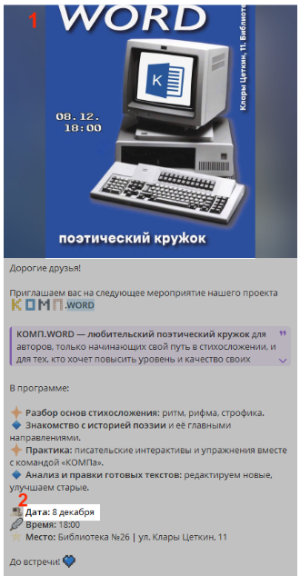
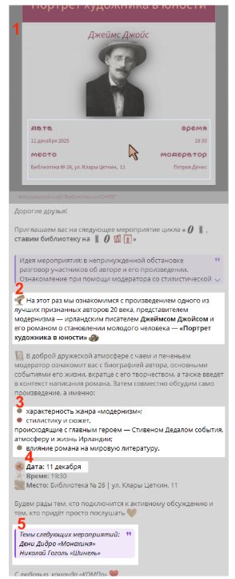
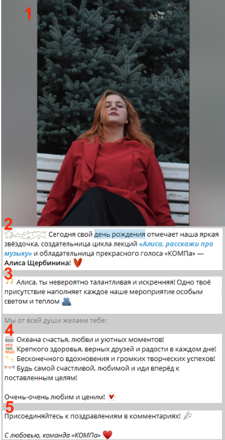

# Регулярные оформления постов

> Источник: «Гайд для редакторов v.2.1.0.pdf»

## Навигация

- [Поэтический кружок «КОМП.WORD»](#поэтический-кружок-компword)
- [Обсуждение книг «Ок, ставим библиотеку на КОМП»](#обсуждение-книг-ок-ставим-библиотеку-на-комп)
- [Дни рождения](#дни-рождения)

---

## Поэтический кружок «КОМП.WORD»

Это регулярная рубрика с устойчивым форматом: важна короткая актуализация, а не полная переписка текста.

### Базовый принцип

1. Берём шаблон из предыдущего поста.
2. Просим актуальную афишу у дизайнера рубрики.
3. Меняем дату и заголовок события.
4. Сохраняем приветствие, контекст и подпись в общем стиле канала.

### Рекомендуемая структура

- Приветствие;
- контекст о встрече;
- дата и место;
- подпись.

### Пример поста

[Ссылка на пример поста в Telegram](https://t.me/komppoet/1526)

> **Заранее копируем текст из любого аналогичного поста в качестве шаблона.**
>
> **Обращаем внимание, что без премиума в Telegram премиумные эмодзи превратятся в обычные.**
>
> 1. Просим актуальную афишу у дизайнера этой рубрики – Марты Скопа (tg: @nebudimenya69) и прикрепляем к посту.
> 2. Заменяем дату на актуальную.

---

## Обсуждение книг «Ок, ставим библиотеку на КОМП»

Это рубрика книжного клуба: у неё есть стабильный формат, но в каждом выпуске нужно обновлять тему и список книг.

### Базовый принцип

1. Берём предыдущий пост как шаблон.
2. Подгружаем актуальную афишу.
3. Обновляем описание книги и темы для обсуждения.
4. Меняем дату встречи.
5. Проверяем список книг для следующего выпуска.

### Рекомендуемая структура

- Приветствие;
- описание книги и темы обсуждения;
- дата и формат встречи;
- подпись.

### Пример поста

[Ссылка на пример поста в Telegram](https://t.me/komppoet/1528)

> **Заранее копируем текст из любого аналогичного поста в качестве шаблона.**
>
> **Обращаем внимание, что без премиума в Telegram премиумные эмодзи превратятся в обычные.**
>
> 1. Просим актуальную афишу у дизайнера этой рубрики – (@denis_ancel) и прикрепляем к посту.
> 2. Заменяем описание книги той, которая будет обсуждаться на этой неделе.
> 3. Заменяем темы для обсуждения, если в варианте, предложенном Денисом (@denis_ancel), они отличаются.
> 4. Заменяем дату на актуальную.
> 5. Обновляем список книг для обсуждения на следующей встрече: удаляем уже обсуждённые книги и добавляем новые по необходимости.

---

## Дни рождения

Эта рубрика — про тёплое поздравление, без сравнений и вычурных формулировок. Важно подчеркнуть роль человека в сообществе и добавить личное, но не пафосное пожелание.

### Базовый принцип

1. Выбираем фото именинника.
2. Пишем приветствие и называем человека по имени.
3. Добавляем контекст: какую роль он выполняет в команде.
4. Пишем основную часть в формате списка пожеланий.
5. Завершаем подписью и призывом к поздравлению в комментариях.

### Рекомендуемая структура

- Приветствие;
- контекст поздравления;
- список пожеланий;
- подпись с фирменной формулой «С любовью…».

### Пример поста

[Ссылка на пример поста в Telegram](https://t.me/komppoet/1542)

> 1. Выбираем фото именинника. Можно спросить у самого именинника, какое фото он хочет видеть в поздравительном посте.
>
> Фото загружаем из файла, чтобы не потерять качество изображения.
>
> 2. Пишем приветствие – рассказываем, кого поздравляем и какую роль выполняет именинник в нашей команде.
> 3. Пишем контекст – вступление перед списком пожеланий на день рождения.
> 4. Пишем основную часть – пожелания на праздник в формате списка.
>
> Важно! Не пишем, что человек делает что-то (пишет стихи, поёт) лучше всех, дабы никого не сравнивать – все уникальны по-своему!
>
> 5. Добавляем подпись – просим аудиторию присоединиться к поздравлению в комментариях. Также в подписи добавляем фирменную фразу «С любовью…».

---

## Короткая памятка

Для регулярных рубрик лучше всего держать минимальный, но стабильный шаблон:

- одинаковое приветствие;
- одинаковый набор блоков;
- актуальные данные по событию;
- одна и та же логика подписи.

Это позволяет быстро готовить посты в едином стиле.
